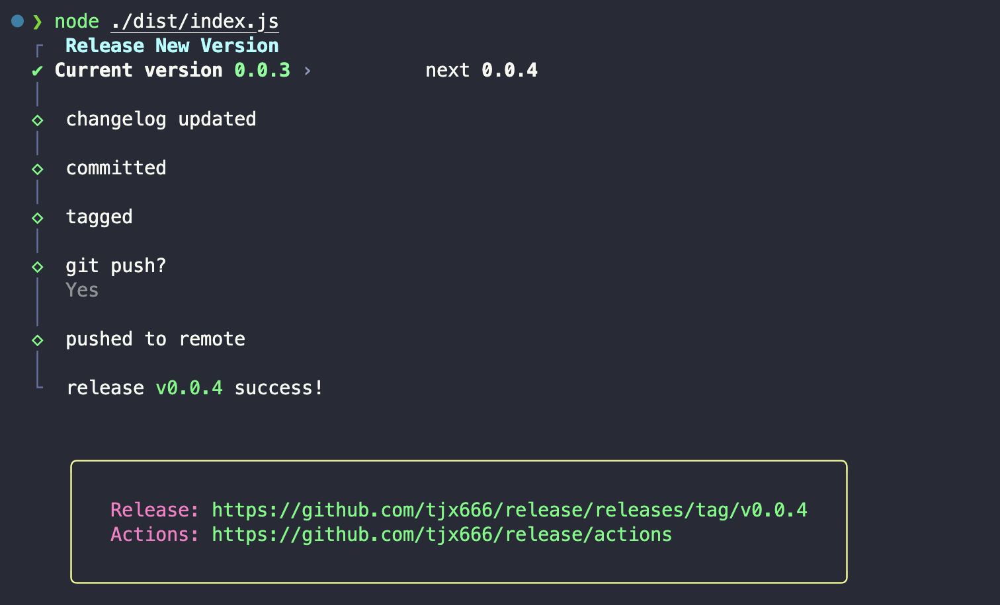

# Release

[](https://npmjs.com/package/@yutengjing/release) [](https://npmjs.com/package/@yutengjing/release) [](https://github.com/tjx666/release/actions/workflows/test.yml)



A personal use release tool for generating changelog and bump.

this cli will do following things:

1. bump a new version to `package.json` by [bumpp](https://github.com/antfu/bumpp)
2. generate changelog by [changelogen](https://github.com/unjs/changelogen)
3. `git add -A`
4. `git commit -m "release: v0.0.1`
5. `git tag --annotate v0.0.1 --message "release: v0.0.1"`
6. `git push`
7. `git push --tags`

## Installation

```bash
pnpm install -g @yutengjing/release
```

## Usage

```bash
release
```

## Related

- [changelogen](https://github.com/unjs/changelogen) generate changelog
- [bumpp](https://github.com/antfu/bumpp) bump version

## License

[MIT](./LICENSE) License © 2023-PRESENT [YuTengjing](https://github.com/tjx666)
